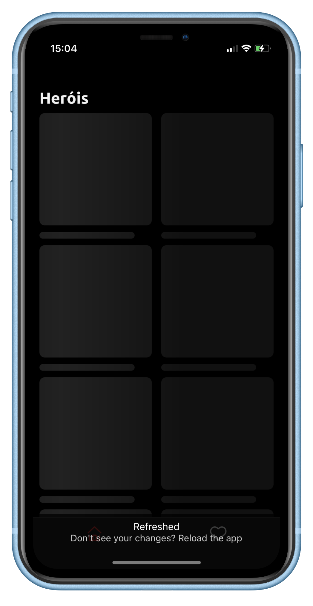
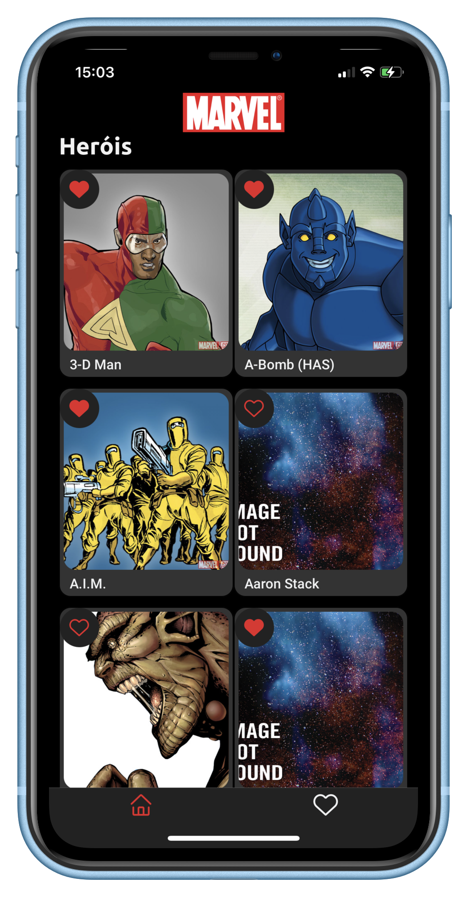
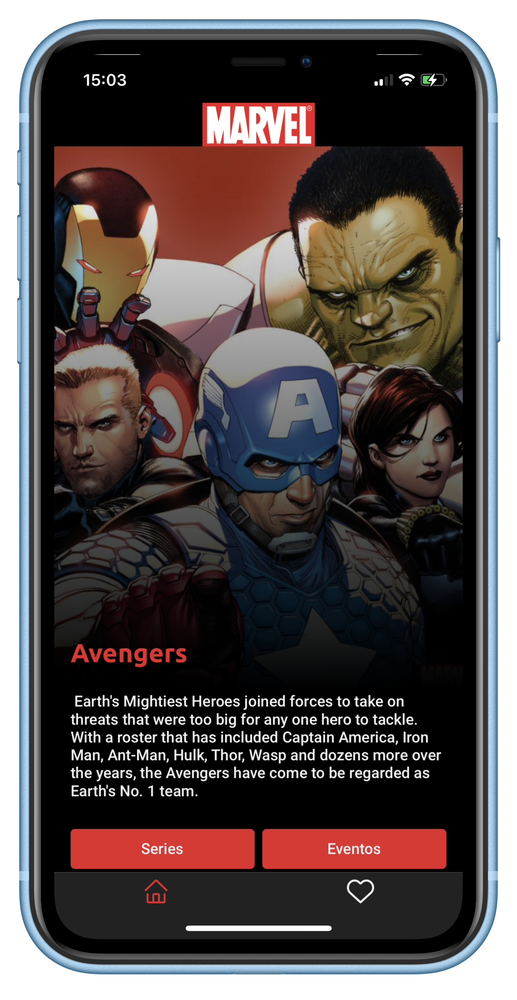
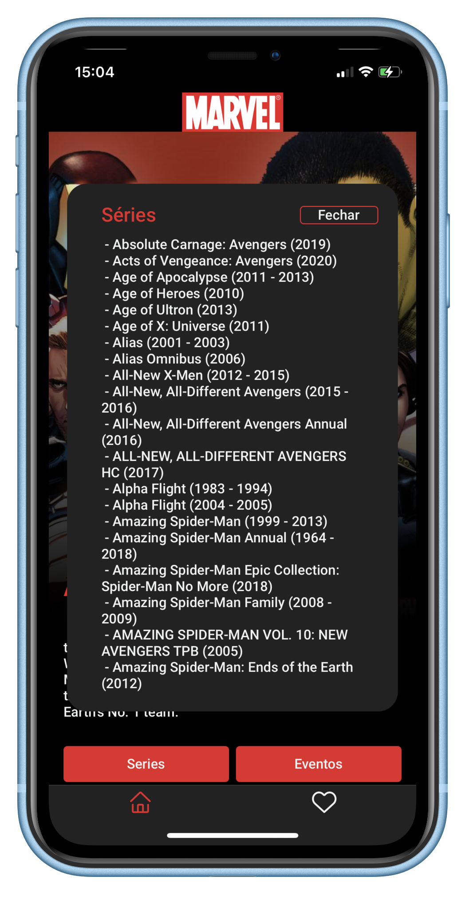
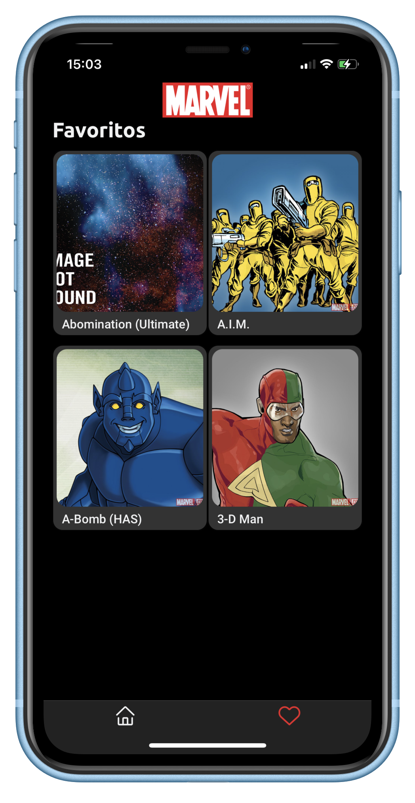
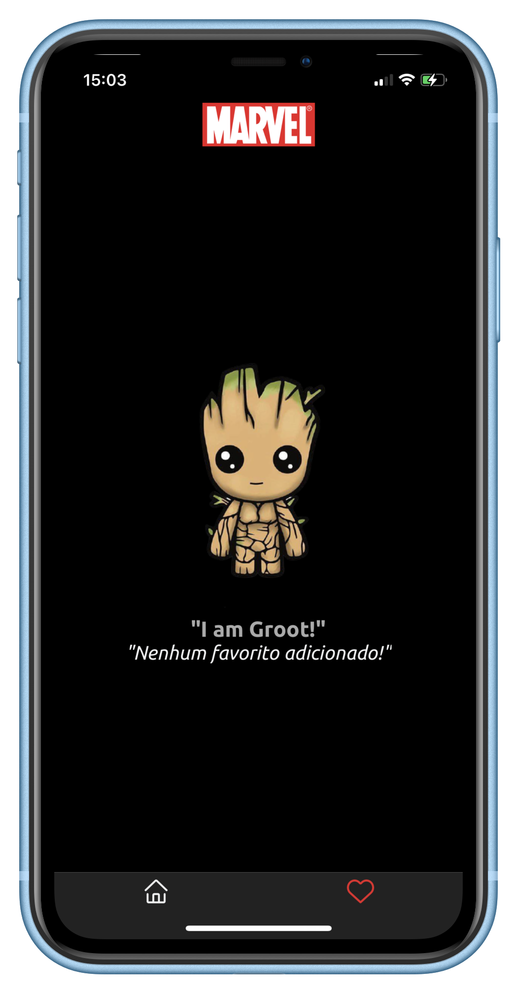

# Desafio em React Native

## O que esperamos que você faça?
Somos fãs da Marvel, quem não gosta de Super-heróis?
A ideia é bem simples, queremos um aplicativo que nos mostre todos os personagens da Marvel além de seus eventos e séries.

## Requisitos básicos:
- Utilizar a API de personsagens da marvel; (https://developer.marvel.com/docs)
- O aplicativo deve conter uma listagem paginada em infinite scroll;
- A listagem deverá ser ordenada por nome;
- Uma modal com os detalhes do personagem;
- Deve ser possível favoritar um personagem; (os favoritos devem ser salvos em base local.)
- Deverá disponibilizar dois filtros: nome do personagem e meus favoritos;

## Requisitos técnicos:
- TypeScript;
- Redux;
- Usar persistência de dados; (a livre escolha de base.)

## Gostaríamos que:
- Sua imaginação fluísse em relação a interface.
- Caso tenha tempo, fique a vontade para adicionar o que achar necessário. (mas o tempo estará contando!!!)

## O que iremos avaliar:
- **Iremos observar principalmente a forma com que você irá aplicar o JavaScript.**
- Organização estrutural do projeto;
- Utilização de padrões de desenvolvimento;
- Bom código;
- Tempo utilizado;
- UI/UX; (não precisa ser a melhor, mas precisa ser funcional.)

## Como iremos avaliar?
- Faça um fork desse repósitorio. (o início será contabilizado a partir do envio das instruções.)
- Ao termino, faça seu pull-request. (levaremos em consideração o tempo entre essas duas etapas.)
- Após isso, é conosco!

--

<h3 align="center">
    
    <br><br>
    <br>
</h3>

<p align="center"> 
  <a href="https://github.com/adlerke/challenge-mobile-react-native/commits/master">
    
  </a>
  
   <a href="https://github.com/adlerke/challenge-mobile-react-native/stargazers">
    
  </a>

</p>


## 🎨 Layout

Os usuários tem acesso ao aplicativo onde poderão navegar entre 3 páginas.
<ul>
  <li><b>Home</b> - Que contém a lista completa de personagens</li> 
  <li><b>Favoritos</b> - Que contém a lista de personagens marcados como favoritos na pagina Home</li> 
  <li><b>Detalhes</b> - A partir da pagina Home ou Favoritos o usuário pode entrar na pagina de detalhes que mostra as informações de um herói em específico</li> 
</ul>


<h3 align="center">
    
    
      <br><br>
    
    
      <br><br>
    
    
      <br><br>
</h3>


## 🛠 Construído com:

This project was developed with the following technologies:

-   [React](https://pt-br.reactjs.org/)
-   [React Native](https://reactnative.dev/)
-   [Typescript](https://www.typescriptlang.org/)
-   [Expo](https://expo.io/) - Para facilitar a execução em vários devices
-   [React Navigation](https://reactnavigation.org/) - Facilitar as rotas dentro da aplicação
-   [Axios](https://www.npmjs.com/package/axios) -- Usado para requisições HTTP
-   [Styled Components](https://styled-components.com/) - Para ser possivel usar a sintaxe do CSS na estilização das paginas ao invés de usar o CSS-in-JS
-   [Prettier](https://prettier.io/) - Foratação de código
-   [VS Code](https://code.visualstudio.com/) - Editor de Texto
-   [Expo Vector Icons](https://icons.expo.fyi/) - Icones dentro do Aplicativo
-   [Redux](https://redux.js.org/) -Para gerenciamento de estados globais
-   [Expo Fonts](https://redux.js.org/) -Para facilitar o uso de fontes diferentes dentro do aplicativo


## 🚀 Como executar

Depois de instalar globalmente o [Expo](https://expo.io/) execute:

```bash
# Clone o repositório
$ git clone https://github.com/adlerke/challenge-mobile-react-native

# Acesse a pasta
$ cd challenge-mobile-react-native

# Instale as dependencias
$ yarn

# Inicie o AVD Android ou Emulador iOS
-
# Inicie a aplicação
$ yarn start
#or yarn ios
```

## 📝 Get in touch


<a href="https://twitter.com/adlerkes" target="_blank" >
    
</a>
  <a href="https://www.linkedin.com/in/adler-kesley-34b09511b/" target="_blank" >
  
</a>
<p>With 💙 by <a href="https://instagram.com/_adlerk" target="_blank" >Adler Kesley</a>


[nodejs]: https://nodejs.org/
[expo]: https://expo.io/
[reactjs]: https://reactjs.org
[rn]: https://facebook.github.io/react-native/
[yarn]: https://yarnpkg.com/
[vscode]: https://code.visualstudio.com/
[vceditconfig]: https://marketplace.visualstudio.com/items?itemName=EditorConfig.EditorConfig
[license]: https://opensource.org/licenses/MIT
[vceslint]: https://marketplace.visualstudio.com/items?itemName=dbaeumer.vscode-eslint
[prettier]: https://marketplace.visualstudio.com/items?itemName=esbenp.prettier-vscode
[rs]: https://rocketseat.com.br