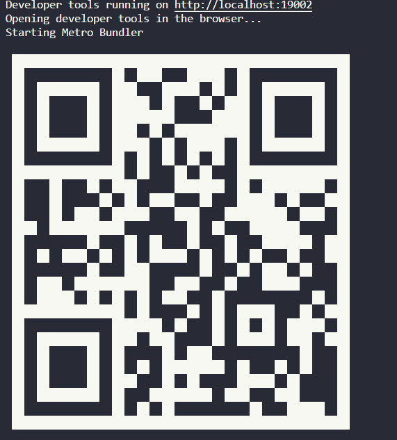
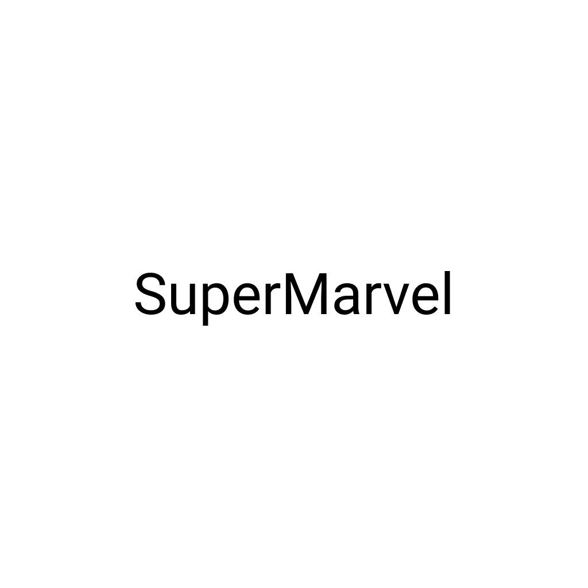
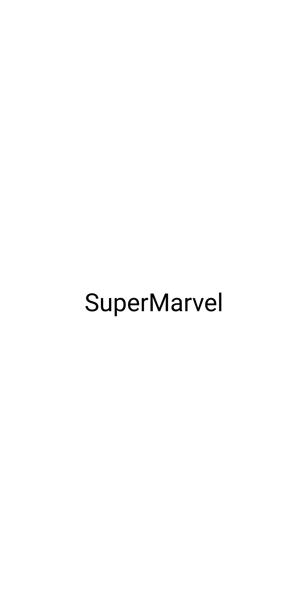
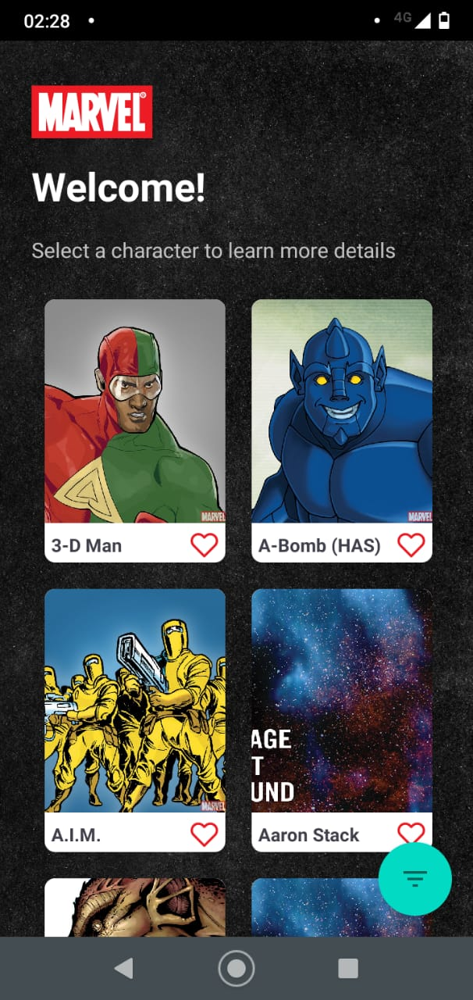
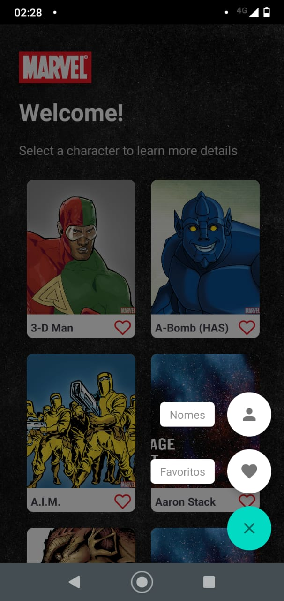
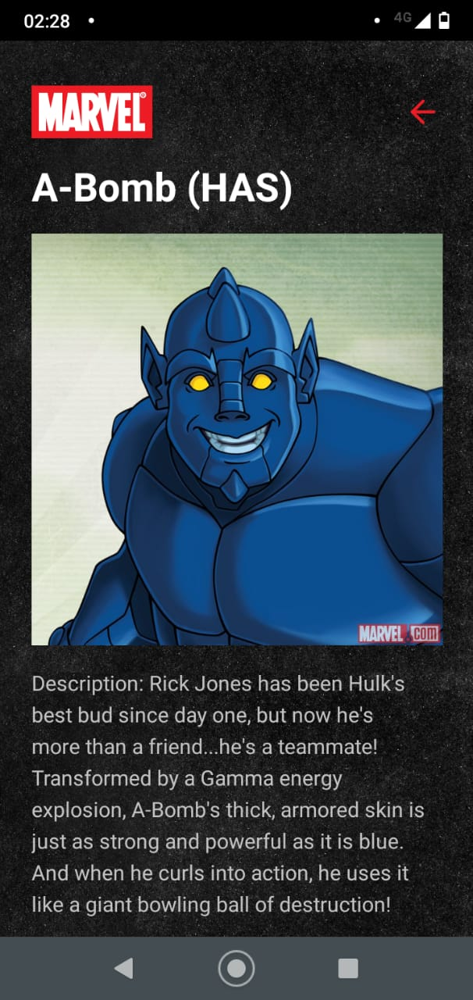
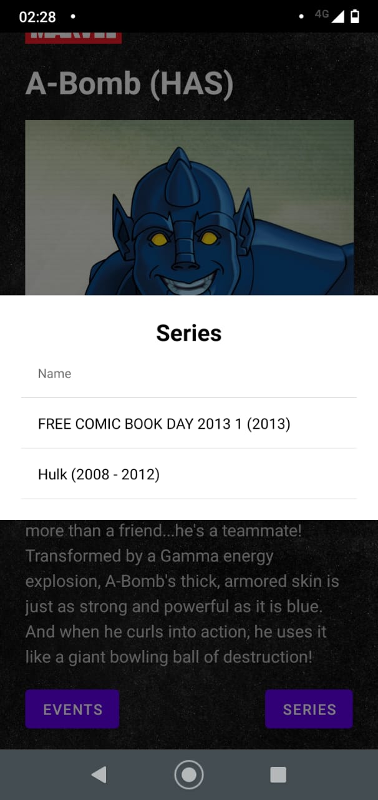

## Sobre

Projeto Frontend referente ao teste Mobile Marvel com React Native solicitado pela **Superlógica**.

---

## Como baixar e iniciar o projeto 1.0

```bash
# Clonar o repositório
$ git clone https://github.com/RenatoRosseto/challenge-mobile-react-native.git

# Entrar no diretório
$ cd challenge-mobile-react-native

# Instalar as dependências
$ yarn install 

# Iniciar o projeto
$ yarn start

```
---
## Iniciar o projeto 2.0

Agora o app está rodando e uma nova aba foi aberta em seu navegador.

<h3>
  
</h3>

Para iniciar no emulador **Android**

- Selecione **Run on Android device/emulator**
- Ou escanear o QR code com Expo app (Android) [link](https://play.google.com/store/apps/details?id=host.exp.exponent&hl=pt_BR&gl=US)

Para iniciar no emulador **iOS**

- Selecione **Run on iOS simulator**
- Ou escanear o QR code com Expo app (iOS) [link](https://apps.apple.com/br/app/expo-go/id982107779)

---

## Imagens do projeto

<h3>
  
</h3>

<h3>
  
</h3>

<h3>
  
</h3>

<h3>
  
</h3>

<h3>
  
</h3>

<h3>
  
</h3>